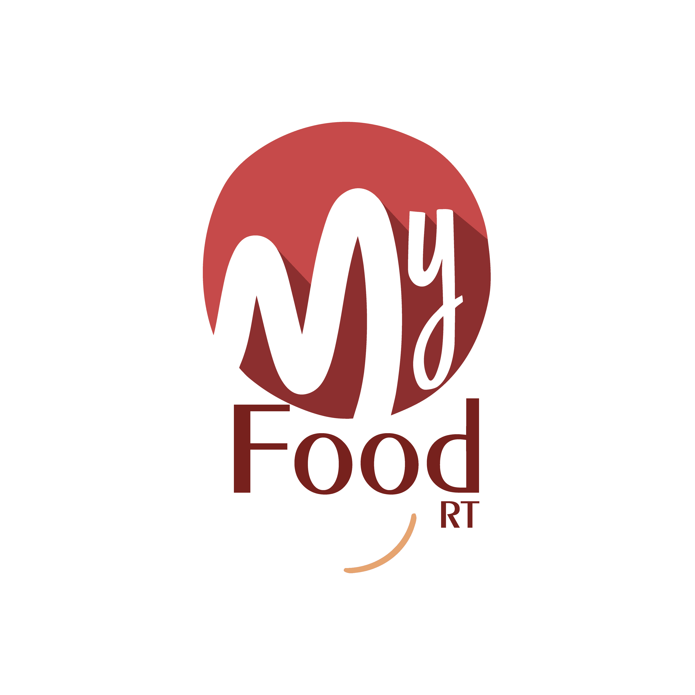

# Myfood

## 1 Concepção do sistema:

  O sistema tem como objetivo fornecer um meio de comunicação entre os usuários de ativos, de consumo e de demanda do restaurantes e lanchonetes cadastrada no sistema para os habitantes locais. Onde irá abranger principalmente jovens que é o nosso público alvo, logo em seguida os demais moradores de uma cidade, e futuramente abranger todo um nicho maior de pessoas, expandido nossos serviços e satisfazendo a demanda dos clientes.

## 2 Funcionalidade:

  Suas qualidades de desempenho e seus conjuntos de suas funções satisfazem as necessidades dos usuários implícitos e formais de maneira adequada. A aplicabilidade sistemática do sistema age com adequação, que é quando as necessidades principais e até mesmo as de “segundo plano” do usuário é e são atendidas devidamente, que no caso é a agilidade e praticidade de realizar as compras desejadas dos seus devidos interesses.O sistema MyFood tem competência e agilidade na área de entrega de comidas delivery, possibilitando fazer o que é proposto por suas políticas interna. Em que seja assegurada uma boa comunicação e uma agilidade da entrega dos pedidos feitos no perímetro do âmbito que se é prometido.
  É capaz de interagir com vários sistemas como Android, IOS, Windows e componentes como celulares smartphone, computadores, tablets entre outros. O usuário terá a segurabilidade de que seus dados não vai ser divulgados e compartilhados com terceiros, estando assegurados da sua segurança e proteção de seus dados.

Foi implementado algumas funcionalidades basicas mas algumas ainda estão sendo implementadas definitivamente como: 

Cadastrar Usuário: Como um usuário de um sistema de delivery eu quero me cadastrar no sistema delivery, para que eu possa usa-lo a fim de otimizar o meu tempo, ganhando comodidade e praticidade.

###Login: Como um usuário de um sistema de  delivery eu quero logar no sistema para que eu posso ter acesso às suas funcionalidades. 

 

Modificar dados de Usuário: Como um usuário de um sistema de delivery, eu quero poder alterar meus dados cadastrados, para que eu possa personalizar minha conta, seja por motivos de segurança ou motivos estéticos.

 
 
Logout: Como um usuário de um sistema de  delivery, eu quero deslogar do sistema para que eu possa ter maior segurança ao usar a aplicação em dispositivos compartilhados com outras pessoas.

Filtrar Produtos: Eu quero poder filtrar as minhas pesquisas por produtos no sistema, para que eu possa facilitar a minha pesquisa por categorias

Realizar Pedido: Como um usuário de um sistema de  delivery, eu quero poder realizar um pedido no sistema, para que eu possa facilitar o processo de compra, podendo escolher várias quantidades e variedades em único pedido.

 

## 3 Lista de Ferramentas:
``` Apache, Sublime, Atom, Navegador de Internet, Bootstrap 4```
## 4 Linguagems:
```HTML5, CSS3```
## 5 Protótipo Funcional (Prototipação de alta fidelidade) : 
```https://marvelapp.com/prototype/7408aaa/screen/89895658```
## 6 Build Para iniciar o serviço com o servidor apache2 siga os seguintes comandos: 
```
apt install git zsh apache2 -y
sudo rm -rf /var/www/html/*
cd /var/www/html
git clone https://github.com/leonardoneto097/myfood.git
sudo mv myfood/* /var/www/html
systemctl start apache2
```


